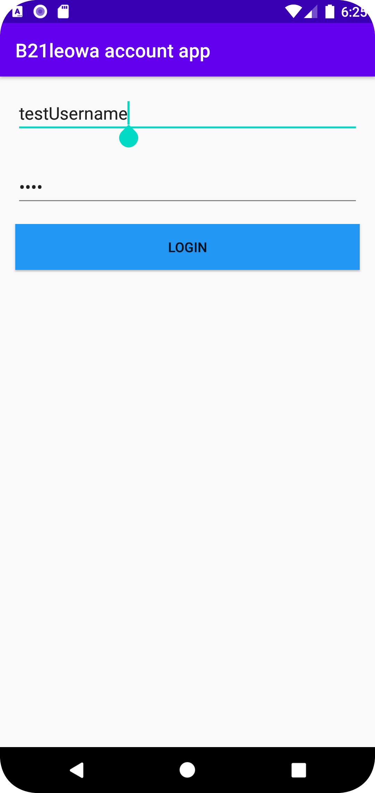
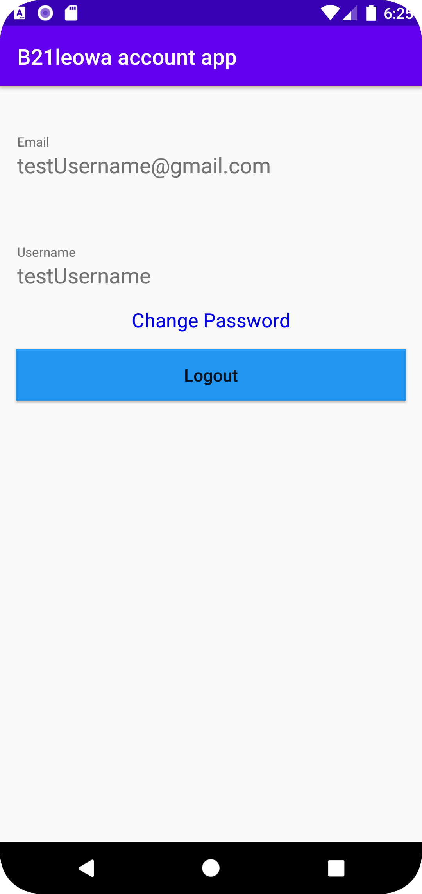

# Rapport

First forked the project widgets and cloned my version of the project.
Then I added secondActivity and added more strings in strings.xml. Also removed constraintLayout and added LinearLayout removed dummy data in Activity_main.xml.

When it was done I added the LoginActivity.java to the AndroidManifest.xml. Then I added intent into the MainActivity.java.
When the login button is pressed, a new intent from Activity_main starts activity which is the LoginActivity class.

Now the intent starts a new activity/LoginActivity it needs something to show. So I added activity_login.xml and added constraintLayout to it inside a ScrollView.
The activity_login.xml now have a TextView with email as hint, another TextView with username as hint. Also added some strings for the activity_login.xml.

I did not like the naming of the activity_login so changed it to activity_profile. Meanwhile it added the git config file so I had to remove it in another commit.

The last commit I added strings into the intent. So when the intent is used it sends Data with it. In this case I send in the username from the editText in activity_main.xml file to the ProfileActivity. See java Snippet
In the activity_profile I displayed the username into the XML by finding the username TextView and used .setText(). I used bundle to get data from MainActivity and put into a String variable, usernameString.
username.setText(usernameString). Because the user does not write down the username the user gets his/her username@gmail.com and to do it I used usernameString and string interpolation with "@gmail.com"

Example result:
usernameString = Test
emailString = Test@gmail.com

The user has to write down a username otherwise the program wont print out anything in username nor email so used a guard to check if username has data. If the user does not put in data the intent wont startActivity
Then I added a logout button that when pressed calls finish() method which exit the intent and put the user back to the activity_main page.
XML Snippet
```xml
<?xml version="1.0" encoding="utf-8"?>
<ScrollView xmlns:android="http://schemas.android.com/apk/res/android"
    xmlns:app="http://schemas.android.com/apk/res-auto"
    xmlns:tools="http://schemas.android.com/tools"
    android:layout_width="match_parent"
    android:layout_height="match_parent"
    tools:context=".ProfileActivity">

    <androidx.constraintlayout.widget.ConstraintLayout
        android:layout_width="match_parent"
        android:layout_height="wrap_content"

        >

        <com.google.android.material.textfield.TextInputLayout
            android:id="@+id/email_layout"
            android:layout_width="match_parent"
            android:layout_height="wrap_content"
            android:padding="16dp"
            app:helperText="Email"
            app:layout_constraintBottom_toTopOf="@+id/username_layout"
            app:layout_constraintLeft_toLeftOf="parent"
            app:layout_constraintLeft_toRightOf="parent"
            app:layout_constraintTop_toTopOf="parent">

            <TextView
                android:id="@+id/email"
                android:layout_width="match_parent"
                android:layout_height="wrap_content"
                android:hint="@string/email"
                android:textSize="20sp" />


        </com.google.android.material.textfield.TextInputLayout>

        <com.google.android.material.textfield.TextInputLayout
            android:id="@+id/username_layout"
            android:layout_width="match_parent"
            android:layout_height="wrap_content"
            android:padding="16dp"
            app:helperText="Username"
            app:layout_constraintBottom_toBottomOf="parent"
            app:layout_constraintLeft_toLeftOf="parent"
            app:layout_constraintLeft_toRightOf="parent"
            app:layout_constraintTop_toTopOf="@+id/email_layout">

            <TextView
                android:id="@+id/username"
                android:layout_width="match_parent"
                android:layout_height="wrap_content"
                android:hint="@string/username"
                android:textSize="20sp" />

        </com.google.android.material.textfield.TextInputLayout>

        <TextView
            android:layout_width="wrap_content"
            android:layout_height="wrap_content"
            app:layout_constraintTop_toBottomOf="@+id/username_layout"
            app:layout_constraintLeft_toLeftOf="parent"
            app:layout_constraintRight_toRightOf="parent"
            app:layout_constraintBottom_toTopOf="@+id/logout_button"
            android:textSize="18sp"
            android:textColor="@color/link_blue"
            android:text="Change Password"
            android:id="@+id/change_password"/>

        <Button
            android:id="@+id/logout_button"
            android:layout_width="match_parent"
            android:layout_height="wrap_content"
            app:layout_constraintRight_toRightOf="parent"
            app:layout_constraintTop_toBottomOf="@+id/change_password"
            app:layout_constraintLeft_toLeftOf="parent"
            app:layout_constraintBottom_toBottomOf="parent"
            android:layout_margin="15dp"
            android:layout_marginTop="32dp"
            android:layout_marginRight="12dp"
            android:text="Logout"
            android:background="@color/button"
            android:textAllCaps="false"
            android:textSize="16sp"
            />
    </androidx.constraintlayout.widget.ConstraintLayout>
</ScrollView>
```
Java Snippet
```java
//MainActivity where I send in username from editText
loginButton = findViewById(R.id.login_button);
       username = findViewById(R.id.username);


       loginButton.setOnClickListener(new View.OnClickListener() {
           @Override
           public void onClick(View v) {
               if(!username.getText().toString().equals("")) {
                   Intent intent = new Intent(MainActivity.this, ProfileActivity.class);
                   intent.putExtra("username", username.getText().toString());
                   startActivity(intent);
                   Log.d("MainActivity", "Login Button pressed");
               }
           }
       });

//ProfileActivity snippet
Bundle extras = getIntent().getExtras();

        username = findViewById(R.id.username);
        email = findViewById(R.id.email);
        logoutButton = findViewById(R.id.logout_button);

        if(extras != null) {
            String usernameString = extras.getString("username");
            String emailString = usernameString + "@gmail.com";
            username.setText(usernameString);
            email.setText(emailString);
        }

        logoutButton.setOnClickListener(new View.OnClickListener() {
            public void onClick(View v) {
                finish();
            }
        });


```


Login view


Profile view

